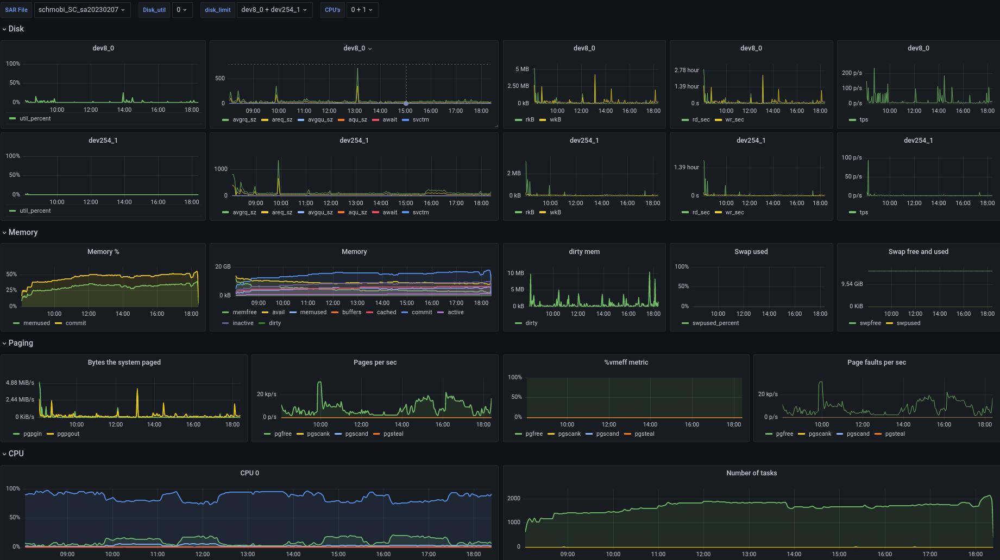
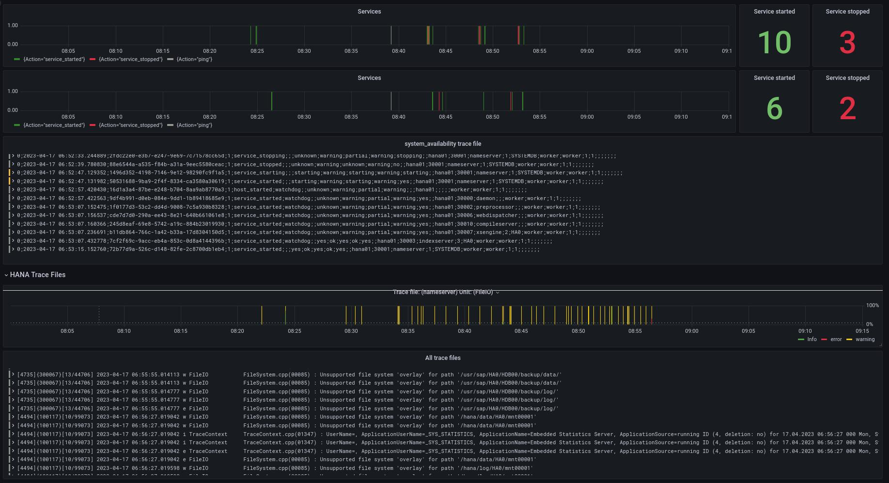

 

Especially for support it is often needed to get an overview about different logs, traces and system statistics in a special timeframe. Having all this data in a graphical view ist often very useful. To get all those different data offline, the unpacked data of the following tools can be used:

- **Full System Info Dump:**
SAP is using a so called "HANA Full System Info Dump" (see SAP Note 2573880 - FAQ: SAP HANA Full System Info Dump) for collecting data and to analyse HANA systems. Such a dump provides all the trace file from a special timeframe. 
- **Supportconfig:**
In addition a supportconfig also contains usefull informations as well as sar files. 

---

To gain first experiences in capturing offline traces and logs I've created 3 Docker container. One is a normal Grafana container, one is a mysql container and the last one contains a python script, promtail, loki and logcli.

**Important:** At the moment **GrafHista** is a **Beta** version and only a few files can be used for analyzing. 


#### Why is this project named GrafHista:
In the very beginning of the idea to collect offline data, I've put all the code into [GrafHana](https://gitlab.suse.de/tschloss/grafhana/) as additional feature. After some time I deside to move it to a separate project. Therefore a new namen was needed. The name continues the "pun" with Grafana and contains the words **Grafana**, **History** and **analyze**.


## How to use:

The following command will deploy and start **GrafHista**:

**docker-compose up -d**

Once docker-composed is started the Grafana Dashboard can be reached under http://localhost:3000

#### Where to put the data

To be able to switch between different dumps and supportconfig files the unpacked data can be linked to there abbreviations (fu, sc).

```
├─ logs
│   ├── fu -> fullsysteminfodump_HA0_SYSTEMDB_hana01_2023_02_13_13_38_02
│   ├── fullsysteminfodump_HA0_SYSTEMDB_hana01_2023_02_13_13_38_02
│   ├── sc -> scc_hana01_230209_0848
│   ├── scc_hana01_230209_0848
	
```
#### SAR Files

In case of sar files, the python script **create_sar_db.py** will be triggert on every change in the **logs** folder and will collect all sar binary files and put it into a DB. Grafana is then using the DB to show all the values. 

##### Database

Each database is a sar file and each table within the db is a single report.
The db name contains **[hostname] _ [FU|SC] _ [sarfile]**

```
 show databases;
+--------------------+
| Database           |
+--------------------+
| [...]              |
| nuc5_FU_sa20230417 |
| nuc5_SC_sa20230415 |
| nuc5_SC_sa20230416 |
| nuc5_SC_sa20230417 |
+--------------------+
```

```
mysql> show tables;
+------------------------------+
| Tables_in_nuc5_FU_sa20230417 |
+------------------------------+
| cpu_load                     |
| disk                         |
| kernel                       |
| memory                       |
| paging                       |
| queue                        |
| swap                         |
| swap_pages                   |
+------------------------------+

```


##### SAR File part of the dashboard

Pulldown menue where you can choose/filter the sar data:


- **SARFile** - Switch between different sar files
- **CPU's** - ON default CPU all is used but it is also possible to select single CPU's.
- **DISK** - Choose one or more disk's.
- **Disk__util** - It is sometimes useful to set the utilisazion in present on systems with a lot of disk's. Default is 0%.

Dashboard example:



#### SAP Trace Files

The promtail configuration is currently capture only trace files with the following bash wildcard:
```
logs/fu/HDB*/*/trace/*[0-9].[0-9][0-9][0-9].trc
```

This results in files like:
```
nameserver_alert_hana01.trc
nameserver_hana01.00000.000.trc
nameserver_hana01.30001.000.trc
nameserver_hana01.30001.001.trc
```

But not in files like: 
```
nameserver_hana01.30001.component_history.000.csv
nameserver_hana01.30001.executed_statements.000.trc
```

There are also logs from the supportconfig if it fits to the same timeframe:

```
logs/sc/messages.txt
```

##### Tracefiles part of the dashboard

Pulldown menue where you can choose/filter the traces:


- **TraceFile** - Select one or more tracefile type's.
- **Service** - Needed for the **HANA Services** part where you can see if a service like _indexserver_ or _nameserver_ has been started or stopped (system_availability.trc)
- **Units** - Most of the trace files have "units" like you can use it on linux system with journalctl --unit=UNIT.  

Dashboard example:



