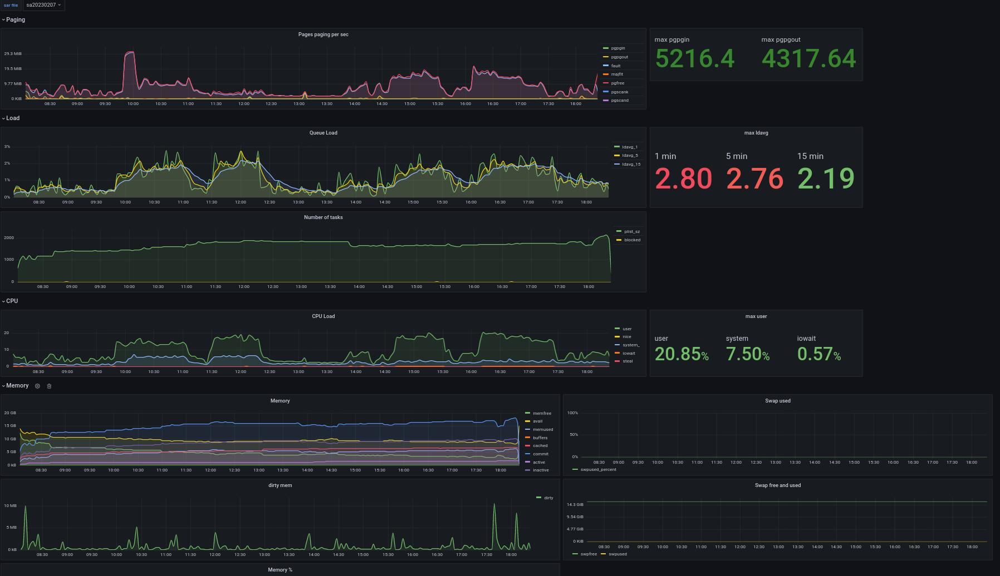

# GrafHista

Especially for support it is often usefull to have an overview about different logs in a special timeframe. 

SAP is using a so called "HANA Full System Info Dump" (see SAP Note 2573880 - FAQ: SAP HANA Full System Info Dump) for collecting data when something goes wrong and they need to analyse customer systems. Such a dump provides also all the trace file from a special timeframe. The idea is to use **GrafHista** for analysing these traces as well. 

To gain first experiences in capturing offline traces and logs I've created three  Docker container. One is a normal Grafana container, one is a mysql container and the last one contains promtail, loki and logcli.

### How to use:

All logs should be placed in a subfolder under logs/ (for example: logs/**my-trace/**). 

The following command will create and start **GrafHista**:

**docker-compose up -d**

**Important:** At the moment **GrafHista** is a **Beta** version and only a few files can be used for analyzing. 

#### Why is this project named GrafHista:
In the very beginning of the idea to collect offline data, I've put all the code into the [GrafHana](https://gitlab.suse.de/tschloss/grafhana/) project as additional feature. Using additional different container and the fact that it can 
not only capturing HANA specific data I deside to move it to a separate project.

Therefore a new namen was needed. The name contains the words **Grafana**, **History** and **analyze** in it. In other words:

**Analyzing historical data with Grafana.**

On the Grafana dashboard mysql has to add as an additional source with following settings:

**Host:** mysql  
**User:** root  
**Password:** Suse1234  

There is already a first Grafana Dashboard named **Sar** where each of 
the created databases (sar files)  can be selected.

