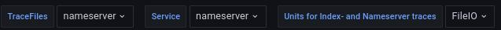

 

Especially for support it is often usefull to have an overview about different logs in a special timeframe. 

SAP is using a so called "HANA Full System Info Dump" (see SAP Note 2573880 - FAQ: SAP HANA Full System Info Dump) for collecting data when something goes wrong and they need to analyse customer systems. Such a dump provides also all the trace file from a special timeframe. The idea is to use **GrafHista** for analysing these traces as well. 

To gain first experiences in capturing offline traces and logs I've created three  Docker container. One is a normal Grafana container, one is a mysql container and the last one contains promtail, loki and logcli.

**Important:** At the moment **GrafHista** is a **Beta** version and only a few files can be used for analyzing. 


#### Why is this project named GrafHista:
In the very beginning of the idea to collect offline data, I've put all the code into the [GrafHana](https://gitlab.suse.de/tschloss/grafhana/) project as additional feature. Using additional different container and the fact that it can not only capturing HANA specific data I deside to move it to a separate project.

Therefore a new namen was needed. The name contains the words **Grafana**, **History** and **analyze**.


## How to use:

The following command will deploy and start **GrafHista**:

**docker-compose up -d**

The idea is to point the unpacked fullsysteminfodump and/or the supportconfig to a symlink.

```
├─ logs
│   ├── fu -> fullsysteminfodump_HA0_SYSTEMDB_hana01_2023_02_13_13_38_02
│   ├── fullsysteminfodump_HA0_SYSTEMDB_hana01_2023_02_13_13_38_02
│   ├── sc -> scc_hana01_230209_0848
│   ├── scc_hana01_230209_0848
	
```
#### SAR Files

In case of sar files, the python script **create_sar_db.py** will be triggert on every change and will collect all sar binary files and put it into a DB. Grafana is using the DB to show all the values. Once docker-composed is started the Grafana Dashboard can be reached under http://localhost:3000

##### SAR File part of the dashboard


#### SAP Trace Files

The promtail configuration is currently capture only trace files with the following bash wildcard:
```
logs/fu/HDB*/*/trace/*[0-9].[0-9][0-9][0-9].trc
```

This results in files like:
```
nameserver_alert_hana01.trc
nameserver_hana01.00000.000.trc
nameserver_hana01.30001.000.trc
nameserver_hana01.30001.001.trc
```

But not in files like: 
```
nameserver_hana01.30001.component_history.000.csv
nameserver_hana01.30001.executed_statements.000.trc
```

There are also logs from the supportconfig if it fits to the same timeframe:

```
logs/sc/messages.txt
```

##### Tracefiles part of the dashboard


Pulldown menue where you can filter the traces:



